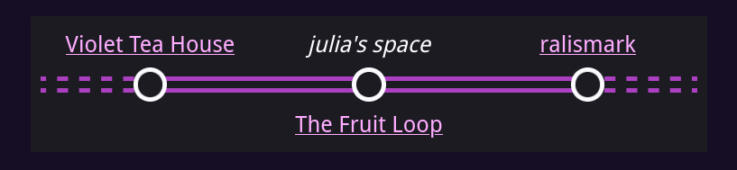
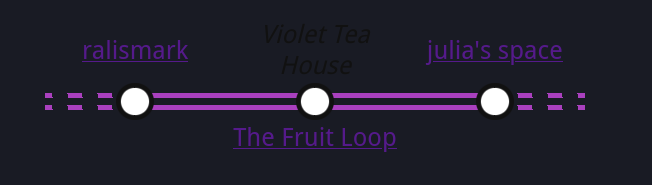

# Wreath Webring Template

Wreath is a template for building a [webrings](https://en.wikipedia.org/wiki/Webring) with Jekyll on GitHub Pages.

## Joining

To add a person to the webring, create a file in the `_ring` folder named `YOUR_NAME.html` -- this name won't be used anywhere except for in the URL of the navbar widget.
Its content should be like this:

```md
---
href: "<url>"
name: "<name>"
blurb: |
  <description>
---

<extra html>
```

where:

- `<url>` is the URL of their website, that links in the webring for your website will point to.
- `<name>` is the name shown in the navbar widget, and on the index page.
- `<description>` is a brief description, used in the listing on the index page.

You can also have a look at existing entries to see examples

## How to embed the navbar

Once you're part of this webring, it's highly recommended that you add the navbar widget to your website.
To do so, include the following html snippet, replacing `YOUR_NAME` with the username you registered with.

```html
<iframe
  style="
    width: 100%;
    max-width: 30rem;
    display: block;
    margin: 0 auto;
    height: 3rem;
    border: none;
  "
  src="{{ "/embed/YOUR_NAME" | absolute_url }}"
></iframe>
```

<!-- {{ "--" }}{{ ">" }}

Here's an example of what it looks like (with an added border so you can see the size):

<iframe
  style="
    width: 100%;
    max-width: 30rem;
    display: block;
    margin: 0 auto;
    height: 3rem;
    border: 1px solid grey;
  "
  src="{{ site.ring[0].url | absolute_url }}"
></iframe>

{{ "<!" }}{{ "--" }} -->

Feel free to tweak the style attribute -- these are just defaults that work for most people.

You can specify `<extra html>` to inject extra CSS to your widget to make it fit in better with your website.

## A note about dark-themed website and iframe backgrounds

The embed is capable of rendering in both light or dark mode.
However, unless you website is correctly configured for it, it may be styled incorrectly:

|Additional background|Unreadable text|
|-|-|
|||

The cause of this is that the browser, by default, assumes your website is light-themed, and either [inserts a background](https://github.com/w3c/csswg-drafts/issues/4772) (case 1), or uses colours suitable for light-themed websites (case 2).
As such, these problems are also more likely to occur in dark-themed websites.

If you already have `<meta name="color-scheme" content="dark light">`, or have `color-scheme: dark light` in your CSS (or similar two-valued `color-scheme`), you shouldn't need to do anything!

Otherwise, if your website:

- **is always dark-themed**, add `<meta name="color-scheme" content="dark">` to the `<head>` of your pages.

- **is always light-themed**, add `<meta name="color-scheme" content="light">` to the `<head>` of your pages.

- **supports both light and dark theme** (e.g. via a theme toggle, or because you respect [`prefers-color-scheme`]), then you need to apply certain CSS rules depending on whether your website is in light or dark mode:

  - In light mode, apply `color-scheme: light` to `:root` or `html` or `body`
  - In dark mode, apply `color-scheme: dark` to `:root` or `html` or `body`

  Make sure they are also correct for the default theme you use!

[`prefers-color-scheme`]: https://developer.mozilla.org/en-US/docs/Web/CSS/@media/prefers-color-scheme

# For users of this template

> you may wish to remove this section when you use this template

To build the site locally, you can use `serve.sh`, which requires [Docker](https://docs.docker.com/engine/install/).
It spins up a Docker container that serves the website on port 5000.

After copying this template, you should change `title` in `_config.yml` to the actual name of your webring.
You can also edit the widget by changing `_layouts/embed.html`.
Since this uses Jekyll, you can also add additional pages to the ring's website by creating `.md` or `.html` files in the root folder.
See [the Jekyll documentation](https://jekyllrb.com/docs/) for more information.

## About the Wreath webring template

This template is a cleaned up version of another webring I ran for a bit in late 2021 -- [sike lipu](https://github.com/ralismark/sike-lipu), a webring for fans of toki pona that were in the ma pona discord server.
I ended up shutting it down in 2021 during a period in my life where I didn't have the time to maintain it.

However, it still kinda lived on as something that inspired the [bucket webring](https://webring.bucketfish.me/about.html), and eventually this webring template.
Turns out, it's actually quite a neat and simple implementation of a webring, that also happens to be completely JS-free!
